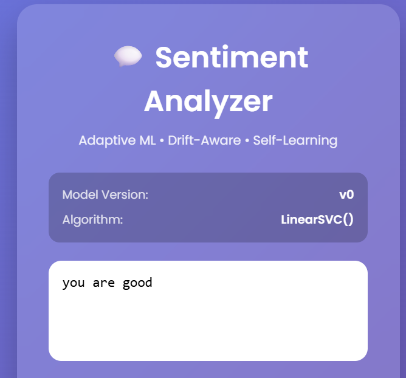
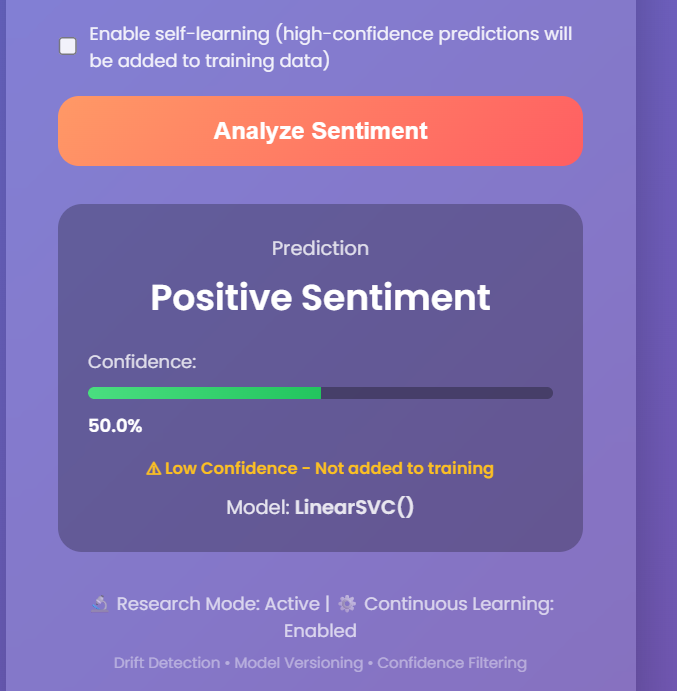

# Self-Training Sentiment Analysis System

**A Research-Grade, Drift-Aware MLOps Pipeline for Adaptive Sentiment Analysis**

[](https://www.python.org/)
[](LICENSE)
[](https://home.cern/)

### 🖼️ Screenshots

<div align="center">
  
  <p><em>Figure 1: Main Interface - System information and prediction form</em></p>
  
  
  <p><em>Figure 2: Output Interface - Prediction results with confidence score</em></p>
</div>

---

## 📚 Documentation

- **[Quick Start](QUICKSTART.md)** - Get started in 5 minutes
- **[Architecture](ARCHITECTURE.md)** - Detailed system architecture and design
- **[API Reference](API.md)** - Complete API documentation
- **[Deployment Guide](DEPLOYMENT.md)** - Production deployment instructions
- **[Contributing](CONTRIBUTING.md)** - Contribution guidelines
- **[Changelog](CHANGELOG.md)** - Version history and changes

---

## 🎯 Problem Statement

Traditional machine learning systems suffer from **model decay** when deployed in production. As data distributions shift over time (data drift) or the relationship between features and labels changes (concept drift), model performance degrades. This is particularly critical in:

- **Large-scale scientific data systems** (e.g., CERN experiments)
- **Long-term production deployments**
- **Dynamic data environments** (social media, sensor networks)

This project addresses these challenges by implementing an **adaptive, drift-aware, self-training MLOps pipeline** that:

1. **Automatically detects drift** in data and model predictions
2. **Triggers retraining only when necessary** (reducing computational costs)
3. **Self-learns from high-confidence predictions** (preventing confirmation bias)
4. **Manages model lifecycle** with versioning and automatic rollback
5. **Tracks experiments** for research and reproducibility

---

## 🏗️ System Architecture

```
┌─────────────────────────────────────────────────────────────────┐
│                    Flask Web Application                         │
│  ┌──────────────┐  ┌──────────────┐  ┌──────────────┐         │
│  │   Predict    │  │ System Info  │  │ Self-Learning │         │
│  │   Endpoint   │  │   Display    │  │   Toggle     │         │
│  └──────┬───────┘  └──────┬───────┘  └──────┬───────┘         │
└─────────┼──────────────────┼──────────────────┼──────────────────┘
          │                  │                  │
          ▼                  ▼                  ▼
┌─────────────────────────────────────────────────────────────────┐
│                    ML Pipeline Core                             │
│                                                                  │
│  ┌──────────────┐  ┌──────────────┐  ┌──────────────┐         │
│  │   Drift      │  │   Training   │  │   Model      │         │
│  │  Detection   │──▶│   Pipeline   │──▶│  Lifecycle   │         │
│  │              │  │              │  │  Management  │         │
│  └──────┬───────┘  └──────┬───────┘  └──────┬───────┘         │
│         │                 │                  │                  │
│         │                 ▼                  ▼                  │
│         │         ┌──────────────┐  ┌──────────────┐          │
│         │         │ Confidence   │  │  Versioning  │          │
│         │         │  Filtering   │  │  & Metadata  │          │
│         │         └──────────────┘  └──────────────┘          │
└─────────┼───────────────────────────────────────────────────────┘
          │
          ▼
┌─────────────────────────────────────────────────────────────────┐
│                    Observability Layer                           │
│                                                                  │
│  ┌──────────────┐  ┌──────────────┐  ┌──────────────┐         │
│  │  Structured  │  │ Experiment   │  │   Model      │         │
│  │   Logging    │  │   Tracking   │  │  Metadata    │         │
│  └──────────────┘  └──────────────┘  └──────────────┘         │
└─────────────────────────────────────────────────────────────────┘
          │
          ▼
┌─────────────────────────────────────────────────────────────────┐
│                    Data Layer                                    │
│                                                                  │
│  ┌──────────────┐  ┌──────────────┐  ┌──────────────┐         │
│  │   MySQL      │  │  Model Store │  │  Experiments  │         │
│  │  Database    │  │  (Versioned) │  │   Directory  │         │
│  └──────────────┘  └──────────────┘  └──────────────┘         │
└─────────────────────────────────────────────────────────────────┘
```

---

## 🔬 Research Motivation

### Why Drift Detection Matters

In production ML systems, **data drift** and **concept drift** are inevitable:

- **Data Drift**: Input feature distributions change (e.g., new vocabulary in social media)
- **Concept Drift**: The relationship P(Y|X) changes (e.g., sentiment shifts for certain topics)

Without drift detection, models silently degrade, leading to:
- Reduced prediction accuracy
- Wasted computational resources (retraining on stable data)
- Loss of system reliability

### Why This System is CERN-Relevant

CERN-scale systems require:

1. **Long-term reliability**: Experiments run for years, data distributions evolve
2. **Automated adaptation**: Manual model updates are impractical at scale
3. **Reproducibility**: Versioned models and tracked experiments enable scientific rigor
4. **Resource efficiency**: Drift-triggered retraining reduces unnecessary computation
5. **Observability**: Structured logging enables debugging and analysis

This system demonstrates these principles in a sentiment analysis context, but the architecture generalizes to any classification task.

---

## 🚀 Key Features

### 1. **Drift Detection** (`ml/drift.py`)

Implements two complementary drift detection methods:

- **Feature Distribution Drift**: Measures changes in TF-IDF feature distributions using:
  - Mean absolute difference (normalized)
  - Population Stability Index (PSI) approximation via KL divergence

- **Confidence Drift**: Measures changes in prediction certainty using:
  - Entropy-based metrics
  - Variance in prediction confidence

**Output**: Combined drift score (0-1) with configurable threshold for retraining.

### 2. **Drift-Triggered Retraining**

The training pipeline (`ml/trainer.py`) checks for drift before retraining:

```python
if drift_score > DRIFT_THRESHOLD:
    retrain_model()
else:
    keep_current_model()
```

This reduces unnecessary retraining and computational costs.

### 3. **Confidence-Filtered Self-Learning**

Self-learning prevents **confirmation bias** by only accepting high-confidence predictions:

```python
if max(prediction_probability) > CONFIDENCE_THRESHOLD:
    accept_sample_for_training()
else:
    store_for_manual_review()
```

**Why this prevents confirmation bias**: By only learning from predictions where the model is highly certain, we avoid reinforcing mistakes. Low-confidence samples are stored separately for review.

### 4. **Model Lifecycle Management** (`utils/model_lifecycle.py`)

- **Versioned models**: Each model version is stored with metadata
- **Automatic rollback**: If a new model performs worse, the system automatically rolls back
- **Metadata tracking**: Training timestamp, dataset size, drift score, validation accuracy

### 5. **Structured Logging** (`utils/logger.py`)

Human-readable, timestamped logs for:
- Training events
- Drift detection
- Model deployments/rollbacks
- System errors

### 6. **Experiment Tracking** (`utils/experiment_tracker.py`)

When `EXPERIMENT_MODE = True`, the system tracks:
- Training metrics over time
- Drift scores history
- Model performance evolution

Enables research analysis and visualization.

### 7. **Enhanced GUI**

The web interface displays:
- Current model version
- Model accuracy
- Last drift score
- Prediction confidence
- Self-learning status

---

## 📦 Installation

### Prerequisites

- Python 3.8+
- MySQL database
- Required Python packages (see `requirements.txt`)

### Setup

1. **Clone the repository**:
```bash
git clone <repository-url>
cd Setiment_analysis
```

2. **Install dependencies**:
```bash
pip install -r requirements.txt
```

3. **Configure database**:
   - Update `config.py` with your MySQL credentials
   - Create the database and table (see `database/data_flag.sql`)

4. **Run the application**:
```bash
python app.py
```

5. **Start the scheduler** (optional, for automated retraining):
```bash
python scheduler.py
```

---

## 🧪 Usage

### Basic Prediction

1. Start the Flask app: `python app.py`
2. Navigate to `http://localhost:5000`
3. Enter text and click "Analyze Sentiment"
4. View prediction, confidence, and system information


### Self-Learning

1. Check "Enable self-learning" checkbox
2. High-confidence predictions (confidence > 0.85) are automatically added to training data
3. Low-confidence predictions are stored in `low_confidence_samples/` for review

### Manual Retraining

```python
from ml.trainer import train_pipeline

# Force retrain (skip drift detection)
model_name, accuracy, drift_info = train_pipeline(force_retrain=True)

# Retrain with drift detection
model_name, accuracy, drift_info = train_pipeline(check_drift=True)
```

### Experiment Mode

Set `EXPERIMENT_MODE = True` in `config.py` to enable:
- Metrics logging to `experiments/metrics_history.json`
- Drift logging to `experiments/drift_history.json`

---

## 📊 Configuration

Key configuration parameters in `config.py`:

```python
# Drift Detection
DRIFT_THRESHOLD = 0.3  # Overall drift score threshold
FEATURE_DRIFT_WEIGHT = 0.6  # Weight for feature drift
CONFIDENCE_DRIFT_WEIGHT = 0.4  # Weight for confidence drift

# Self-Learning
CONFIDENCE_THRESHOLD = 0.85  # Minimum confidence for self-learning

# Model Lifecycle
MIN_IMPROVEMENT_THRESHOLD = 0.01  # 1% minimum improvement to deploy
ROLLBACK_ON_DEGRADATION = True  # Auto-rollback on performance drop

# Experiment Mode
EXPERIMENT_MODE = True  # Enable research tracking
```

---

## 🔍 Project Structure

```
Setiment_analysis/
├── app.py                      # Flask web application
├── config.py                   # System configuration
├── scheduler.py                # Automated retraining scheduler
├── __init__.py                 # Package initialization
│
├── ml/                         # Machine Learning module
│   ├── __init__.py
│   ├── models.py               # Model definitions
│   ├── trainer.py              # Training pipeline with drift detection
│   ├── evaluator.py            # Model evaluation
│   ├── preprocessing.py        # Text preprocessing
│   ├── data_loader.py          # Database data loading
│   ├── drift.py                # Drift detection implementation
│   └── saver.py                # Model saving utilities
│
├── database/                   # Database module
│   ├── __init__.py
│   ├── db.py                   # Database connection
│   └── data_flag.sql           # Database schema
│
├── utils/                      # Utility modules
│   ├── __init__.py
│   ├── logger.py               # Structured logging
│   ├── model_lifecycle.py      # Model versioning and lifecycle
│   └── experiment_tracker.py   # Experiment tracking
│
├── models_store/               # Model storage
│   ├── current_model.pkl
│   ├── model_v1.pkl
│   ├── model_v2.pkl
│   ├── vectorizer.pkl
│   └── metadata.json           # Model metadata
│
├── experiments/                # Experiment data (if EXPERIMENT_MODE=True)
│   ├── metrics_history.json
│   └── drift_history.json
│
├── logs/                       # System logs
│   └── system.log
│
├── templates/                  # HTML templates
│   ├── index.html
│   └── maintainance.html
│
└── static/                     # Static files
    └── style.css
```

---

## 🧪 Reproducing Experiments

### 1. Enable Experiment Mode

Set `EXPERIMENT_MODE = True` in `config.py`.

### 2. Run Training Pipeline

```python
from ml.trainer import train_pipeline
train_pipeline()
```

### 3. Analyze Results

- **Training metrics**: `experiments/metrics_history.json`
- **Drift scores**: `experiments/drift_history.json`
- **Model metadata**: `models_store/metadata.json`
- **System logs**: `logs/system.log`

### 4. Visualization (Future Work)

The experiment data is structured for easy visualization:
- Plot accuracy over time
- Plot drift scores over time
- Analyze model performance vs. drift scores

---

## 🔬 Research Contributions

This system demonstrates:

1. **Adaptive ML**: Automatic drift detection and retraining
2. **Self-Learning**: Confidence-filtered learning prevents confirmation bias
3. **MLOps Best Practices**: Versioning, rollback, observability
4. **Research Reproducibility**: Experiment tracking and metadata

---

## 🛠️ Technical Details

### Drift Detection Algorithm

1. **Feature Distribution Drift**:
   - Compute mean TF-IDF vectors for training and incoming data
   - Calculate normalized mean absolute difference
   - Compute KL divergence as PSI approximation
   - Combine metrics: `(normalized_diff + psi_score) / 2`

2. **Confidence Drift**:
   - Compute prediction entropy for training and incoming data
   - Calculate variance in prediction confidence
   - Combine: `(entropy_diff + var_diff) / 2`

3. **Overall Drift Score**:
   ```
   overall_drift = (feature_weight * feature_drift) + (confidence_weight * confidence_drift)
   ```

### Model Lifecycle

- Models are versioned: `model_v1.pkl`, `model_v2.pkl`, etc.
- Metadata stored in `metadata.json`:
  ```json
  {
    "current_version": 2,
    "models": {
      "v1": {
        "model_name": "RandomForest",
        "accuracy": 0.85,
        "training_timestamp": "2024-01-20T10:30:00",
        "drift_score_at_training": 0.25
      }
    }
  }
  ```

---

## 🚧 Future Enhancements

- [ ] Real-time drift monitoring dashboard
- [ ] Advanced drift detection methods (KS test, MMD)
- [ ] A/B testing framework for model comparison
- [ ] Automated hyperparameter tuning
- [ ] Distributed training support
- [ ] Model explainability (SHAP, LIME)
- [ ] Visualization dashboard for experiments

---

## 📝 License

MIT License - See LICENSE file for details.

---

## 🙏 Acknowledgments

This project is designed to meet research-grade standards suitable for CERN OpenLab environments, demonstrating adaptive ML principles applicable to large-scale scientific data systems.

---

## 📧 Contact

For questions or contributions, please open an issue or contact the development team.

---

**Version**: 2.0.0  
**Last Updated**: 2024  
**Status**: Research-Grade, Production-Ready
